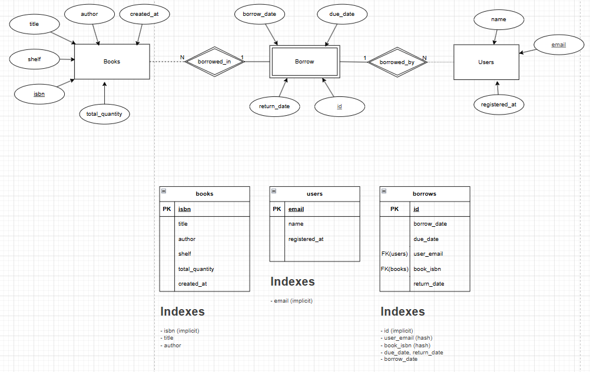
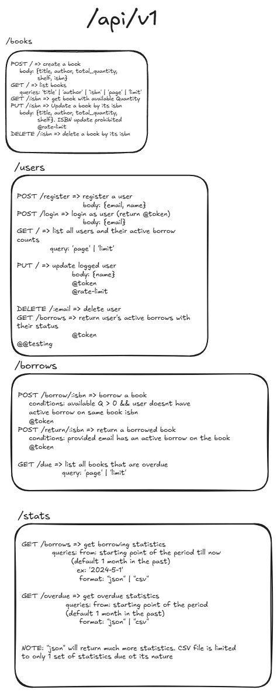

# Library Management System Backend

## Features

Books
- Add a book with details like title, author, ISBN, available quantity, and shelf location.
- Update a book’s details.
- Delete a book.
- List all books.
- Search for a book by title, author, or ISBN.

Borrowers:
- Register a borrower with details like name, email, and registered date (Keep the user
details as simple as possible).
- Update borrower’s details.
- Delete a borrower.
- List all borrowers.

Borrowing Process:
- A borrower can check out a book. The system should keep track of which books are
checked out and by whom.
- A borrower can return a book.
- A borrower can check the books they currently have.
- The system should keep track of due dates for the books and list books that are overdue.

Bonus Features:
1. The system can show analytical reports of the borrowing process in a specific period and
export the borrowing process data in CSV and JSON formats.
2. Exports all overdue borrows of the last month.
3. Exports all borrowing processes of the last month.
4. Implement rate limiting in some endpoints to prevent abuse.
5. Dockerizing the application using docker-compose.
6. Implement very basic authentication for the API.
7. Add unit tests for one module

## Database Schema



The database schema is defined using Prisma ORM.

The draw.io file used is here: [database.drawio](./docs/database.drawio)

## Endpoint Documentation

Endpoints are documented in this Excalidraw file: [API Documentation](./docs/endpoints.excalidraw)



For detailed endpoint documentation, refer to [endpoints.md](./endpoints.md)

## Development

The project has Docker Compose setup for easy development and testing.

1. Ensure you have Docker and Docker Compose installed on your machine.
2. Run the following command to start database only first (very important):

   ```bash
   docker-compose up -d database
   ```

3. Run the following command to start the backend service:

   ```bash
   docker-compose up -d backend
   ```

> Database must be started first and running before backend starts building.
This is because the backend pushes the schema and seeds the database during build process.

### Testing

Run tests with:

```bash
npm test
```